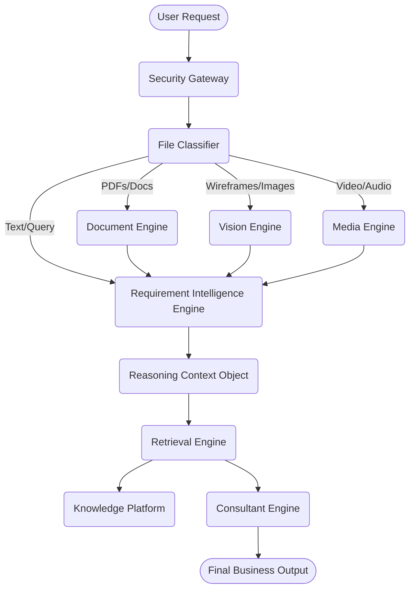

# InGrowth AI Platform - Architecture Specification

## Overview

The InGrowth AI Platform is a robust, modular runtime that powers intelligent business consulting capabilities. It is designed to be provider-agnostic, strictly governed, and highly observable.

## Core Flow

## Layers

### 1. Security & Governance Layer

All inputs (queries and files) pass through the `SecurityGateway`.

- **File Validation**: Enforces MIME types and size limits.
- **Malware Scanning**: Abstraction layer for scanning payloads.
- **Safety**: Prompt Injection detection and PII Redaction.
- **Governance**: Quotas, Rate limits, and Audit Logging in PostgreSQL.

### 2. Multimodal Intelligence (File Intelligence Platform)

Uploaded files are classified by the `FileClassifier` and dispatched to specialized engines:

- **Vision Engine**: OCR, Wireframes, UI Mockups, Architecture diagrams.
- **Document Engine**: PDFs, DOCX, Markdown.
- **Requirement Intelligence Engine**: Structures the multimodal output into a unified JSON format (MVP Scope, Timeline, Tech Stack, Missing Requirements).

### 3. Retrieval & Knowledge Platform

- **Knowledge Platform**: A dual-store (ChromaDB + PostgreSQL) containing company data, blogs, case studies, and services.
- **Retrieval Engine**: Uses Hybrid Search (Vector + BM25) and Semantic Reranking to fetch the best context based on the current RCO state.

### 4. Consultant Engine

An 8-stage intelligent pipeline that:

1. Analyzes Intent
2. Extracts Keywords
3. Invokes Retrieval
4. Compresses Context
5. Generates Initial Draft
6. Validates against Business Rules
7. Finalizes Response

### 5. Orchestration & Observability

- **LangGraphOrchestrator**: Manages state transitions and the invocation of the Consultant Engine.
- **ObservabilityManager**: Snapshots the RCO at every stage and logs traces/events into the Database for the AI Operations Dashboard.
